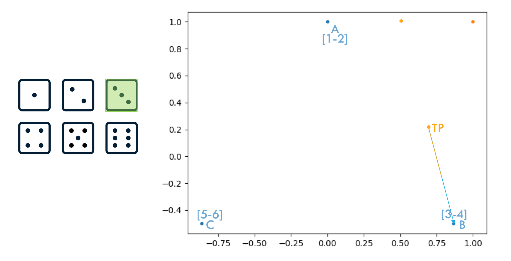

# Chaos Fractal: CS50P Final Project
## Video Demo
[Link](https://www.youtube.com/watch?v=isQBC3hKYi8)
## Description
The project programmatically implements the
"Chaos Game" (inspired by
[this Numberphile video](https://www.youtube.com/watch?v=kbKtFN71Lfs)).
 Additionally, it allows the user to customize output via
 command line arguments and/or prompt responses.

## File and Folder List
| File/Folder Name | Description |
| --- | --- |
| `project.py` | Contains logic and main/helper functions that creates fractal graphs|
| `requirements.txt` | List of required libraries to run `project.py` |
| `test_project.py` | Test code for `project.py`|
| `readme_images` | Contains illustrative images for `README.md` |

## Background
Inspired by the linked Numberphile video in the
description, I wanted to implement a program
that created fractal images through the "Chaos Game" and allowed for user customization.

### Chaos Game Example
Picture a graph with 3 points `A`, `B`, `C`.
These points create the shape triangle `ABC`
(it doesn't have to be equilateral but it will be for
illustrative purposes). There is also a 4th point labeled
`TP`; this will be our start point / trace point.


Now imagine we have a single 6-sided die. We will assign 2 values from the die per triangle point in our graph. `A = [1, 2]`, `B = [3, 4]`,
`C = [5, 6]`.


#### First Roll
We roll the die and get a value of 2. The value 2 is associated with point `A`. We find the distance between our current Trace Point `TP`
and point `A` and multiply that distance by 0.5[^1]—


[^1]: This is known as the dividing rate. For more information on how this value was derived [click here](https://computational-discovery-on-jupyter.github.io/Computational-Discovery-on-Jupyter/Contents/chaos-game-representation.html#sec-generalization).


—And plot a new point. This new point will be our new `TP` point.


#### Second Roll
For our second roll, we get a value of 4, which is associated with point `B`. We find the distance between our newly assigned trace point `TP` and `B`, and then multiply that distance by the dividing rate of 0.5 (also referred to as the `ratio` or `multiplier` in my code).


We then plot a point between `TP` and `B` and assign it as our new trace point `TP`.


#### Third Roll
Our third roll is 3 which is also associated with point `B`. Similarly to before, we find the distance between our current trace point `TP` and `B`, we then multiply that distance by the dividing rate and plot/assign our new trace point `TP`.





#### Fourth Roll
Our fourth and final illustrative roll is 6 which is associated with point `C` (what a surprise!). We find the distance between our current trace point `TP` and `C`, we then multiply that distance by the dividing rate and plot/assign our new trace point `TP`.


#### Fifth Roll and On
So why are we doing this? Mathematicians have found that if we repeat this random selection between points enough times we can get some interesting images. Specifically: Fractals.

If we were to continue to roll our die 100 times we would get something similar to the following image:


Rolling our die 500 times would yield:


2000 rolls:


And finally, 15,000 die rolls would give us the below image:


### Modifications to the Chaos Game
To me, the previous demonstration of the Chaos Game begs a few questions:

1. Does the game work with other shapes?
2. Can we get different fractals for different dividing rates (ex: instead of going half the distance after selection we go 2/3rds of the distance)?

The answer to both of these questions is yes, and is exactly what my program sets out to allow users to experiment with!

## Usage
### Basic
The following command-line code is sufficient to run the program.
```
python project.py
```
The user will then be prompted to provide a number of sides (vertices) for the starting shape (3 for triangle, 4 for square/rectangle, etc.).

The user will then be asked if they would like the starting shape to be equilateral and must provide a `True` or `False` response (variations of strings such as `true` or `f` accepted). If `False` is provided, the starting shape will receive random minute adjustments that will produce an irregular shape.

### Options
The following command-line code will immediately output a graph without further prompting the user.
```
python project.py -s|--sides [int] -e [str] -m|--multi [float] -r|--res [int] -x [int] -y [int]
```
Only `-s` and `-e` are required to output a graph without additional prompts from the program. For more information on what these options are and what they do go to the [Argparser section](#argparser).

## Design
I will now step through the logic of `project.py` and discuss my design methodology.
### `main()`
#### Argparser
I wanted to include a way for the user to bypass
any prompts the code would output
so I utilized the `argparse` library to allow users to directly input their custom options before running the program.

Using the `argparse` library, the following options are defined and extracted from the command-line:

| Option Flag | Verbose Flag | Type | Description | Default Value
| --- | --- | --- | --- | --- |
| `-s` | `--sides` | `int` | Number of sides (vertices) for starting polygon | None; prompted until valid response received |
| `-e` | N/A | `bool` | Equilateral option: `True` = Equilateral, `False` = Irregular | None; prompted until valid response received |
| `-m` | `--multi` | `float` | Distance traveled from start point multiplier (AKA: ratio, dividing rate) | Derived from formula ([see here](#get_ideal_ratiosides)) |
| `-r` | `--res` | `int` | Plot resolution (number of points) | 15,000 |
| `-x` | N/A | `float` | X coordinate start point for trace point | 0 |
| `-y` | N/A | `float` | Y coordinate start point for trace point | 0 |

#### Sides
If a valid value is given in the command-line via `-s` or `--sides`, then that value gets assigned to the variable `sides`.

If no valid value is given in the command-line via `-s` or `--sides`, then the program calls the `get_sides()` helper function ([more info here](#get_sides)), which returns a valid number of sides, and is subsequently assigned to the variable `sides`.

#### Equilateral
If a valid value is given in the command-line via `-e`, then that value is determined to either be `True` or `False` and gets assigned to the variable `equilateral_option`.

If no valid value is given in the command-line via `-e`, then the program calls the `get_equilateral()` helper function ([more info here](#get_equilateral)) which returns a boolean value that then gets assigned to the variable `equilateral_option`.

#### Polygon Creation
Variables `sides` and `equilateral_option` are used as inputs to the `create_polygon()` function ([more info here](#create_polygonsides-equilateral-radius1-rotation0)). The `create_polygon()` function returns the X and Y values of the desired polygon (as stipulated by `sides` and `equilateral_option`) and assigns them to the `start_x` and `start_y` variables, respectively.

`start_x` and `start_y` are then used as inputs to the `scatter()` function from `matplotlib`, which creates a plot object with our starter shape.

#### Trace Point
Variable `trace_point` is assigned the list value `[0, 0]`. The list value represents the `[x, y]` coordinate of our trace point. `[0, 0]` is our default trace point value if no valid options are passed via `-x` or `-y` at the command-line.

If a valid argument is passed at the command line for `-x` or `-y` then that new value will replace the respective default in `trace_point`.

`trace_point` is then unpacked and passed to the `scatter()` function on our plot object, resulting in our trace point being plotted on the graph.

The plot is then saved as `initial.png` via the `savefig()` function from `matplotlib`.

#### Resolution
Variable `resolution` is assigned the value `15000`.

If a valid value is given in the command-line via `-r` or `--res`, then that value gets assigned to the variable `resolution`.

#### Ideal Ratio
The variable `ratio` is assigned the return value of the function `get_ideal_ratio()` which takes `sides` as an input ([more info here](#get_ideal_ratiosides)).

If a valid value is given in the command-line via `-m` or `--multi`, then `ratio` is overwritten by that value instead.

#### Array of Trace Points and Final Plot
The main implementation of the logic of the Chaos Game occurs in the helper function `create_fractal_array_xy()` ([more info here](#create_fractal_array_xystart_x-start_y-trace_point-resolution-multiplier)). The function will return 2 lists of X and Y coordinates that contain all of the trace point's positions as it iterates through the Chaos Game (rolling the die, per se).

`create_fractal_array_xy()` takes all of the following as inputs:
- `start_x`: X coordinates of our starting shape.
- `start_y`: Y coordinates of our starting shape.
- `trace_point`: Starting [x, y] coordinates of our trace point.
- `resolution`: The number of iterations (the number of times we will "roll the die").
- `ratio`: The dividing rate (AKA multiplier).

The returned values of the function are then assigned to variables `x` and `y`. `x` and `y` are then used as inputs to the `matplotlib` function `scatter()` which plots our trace points onto our plot object. Function `savefig()` is then used to save our final plot as `fractal.png`.

#### Open Final Plot
As a final flourish for my project, I wanted the program to open `fractal.png` before exiting. The only way I could get it to work was by sending the following code to the command-line which opens the fractal graph file:
```
code fractal.png
```
I utilized a solution provided by Stack Overflow users Blender and Travis Cunningham ([source](https://stackoverflow.com/a/12605520)). They recommended the usage of `Popen` and `PIPE` from the `subprocess` library. This successfully opens `fractal.png`.
### Helper Functions
#### `get_sides()`
This function prompts the user for a valid number of sides for our starting shape. If the user does not provide a valid response the function will re-prompt them until they do.

Using the `re` library, a response must satisfy the following `regex` pattern:
```
^\d+$
```
The pattern searches for a response that contains at least 1 or more numeric digits. If the value of the digit provided is less than 2 then the user is re-prompted until a value at least greater than 2 is provided.

When a valid response is provided that response is then converted to an `int` and returned.

#### `get_equilateral()`
This function prompts the user for a valid True/False response to the prompt: "Equilateral? [True/False]". If the user does not provide a valid response the function will re-prompt them until they do.

Using the `re` library, a response must satisfy the following `regex` pattern:
```
^(True|true|T|t|False|false|F|f)$
```
If "t" is found in the lowercase version of the valid response, then `True` is returned. Otherwise, `False` is returned.

#### `create_polygon([sides], [equilateral], [radius=1], [rotation=0])`
This function creates our starting shape and was modified from Stack Overflow user Jon Betts' post ([source](https://stackoverflow.com/a/23414895)).

Per Jon Betts:
>The basic approach is to sweep out a circle, and put n equally spaced points on it. These will be the points of our polygon, starting at the 12 'o' clock position. The first thing to do is work out the angle (in radians) of each wedge from the center outwards. The total number of radians in a circle is 2 pi, so our value is 2 pi / n per segment. After that a bit of basic trig gives us our points (https://en.wikipedia.org/wiki/Trigonometry#Extending_the_definitions). At this point we scale by our desired radius, and have the opportunity to offset the rotation by a fixed amount too.

My main modification to Jon's code was to include a new `equilateral` boolean input. If `True`, the function behaves as Jon outlines above. If `False`, small random perturbations are added/subtracted from each point's coordinates to create irregular shapes. These small perturbations are created by the `uniform()` function from the `random` library.

> [!NOTE]
> In the current implementation of this code both `rotation` and `radius` inputs are not functionally in use. I've kept them in the code to allow for potential future modifications that may incorporate them. I hesitated to include any functionality involving these inputs (such as prompting the user) because I was worried my program would become unwieldy due to an overabundance of interactivity. I may change my mind on this in the future, however.

After going through the aforementioned logic, `create_polygon()` then returns the starting shape's X coordinates and Y coordinates as 2 separate lists.
#### `get_ideal_ratio([sides])`
This function takes the number of sides of our starting shape and determines the ideal ratio/dividing rate to create a fractal graph.

The function applies the mathematical formula outlined [here](https://computational-discovery-on-jupyter.github.io/Computational-Discovery-on-Jupyter/Contents/chaos-game-representation.html#sec-generalization) and returns the resulting value.
#### `create_fractal_array_xy([start_x], [start_y], [trace_point], [resolution], [multiplier])`
As noted earlier, this function is the main programmatic implementation of the Chaos Game.

Steps:

1. The function randomly chooses an index value from the list `start_x` using the `choice()` function from the `random` library. This value is assigned to the variable `choice`. Note that with this new variable we have now essentially randomly selected a vertex in our starting shape with the coordinates `[start_x[choice], start_y[choice]]`.
2. The function then finds the distance between our trace point X and Y coordinates (`trace_point[0]` and `trace_point[1]` respectively) and our randomly chosen starting shape vertex X/Y coordinates, multiplies that distance by our dividing rate variable `multiplier`, subtracts that value from our initial trace point coordinates, and then finally reassigns these values to our `trace_point` variable.
3. Our new `trace_point` value is then appended to list `trace_points`.

Steps 1-3 are then repeated (as determined by `resolution`).

Finally, our list of trace point coordinates in our `trace_points` list are returned as 2 separate lists that correspond to each trace point's X and Y coordinates.

## Example Outputs
```
python project.py -s 4 -e t
```


```
python project.py -s 5 -e t
```


```
python project.py -s 5 -e t -m 0.7
```


```
python project.py -s 5 -e t -m 0.55
```


```
python project.py -s 6 -e t
```


```
python project.py -s 6 -e f
```


```
python project.py -s 7 -e t -x 2 -y 1
```


```
python project.py -s 3 -e t -m 2
```

```
python project.py -s 3 -e t -m 2
```


```
python project.py -s 3 -e t -m 2
```


```
python project.py -s 3 -e t -m 2
```


```
python project.py -s 3 -e t -m 2
```

